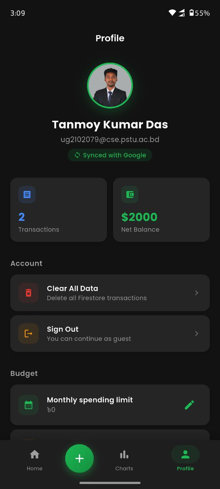
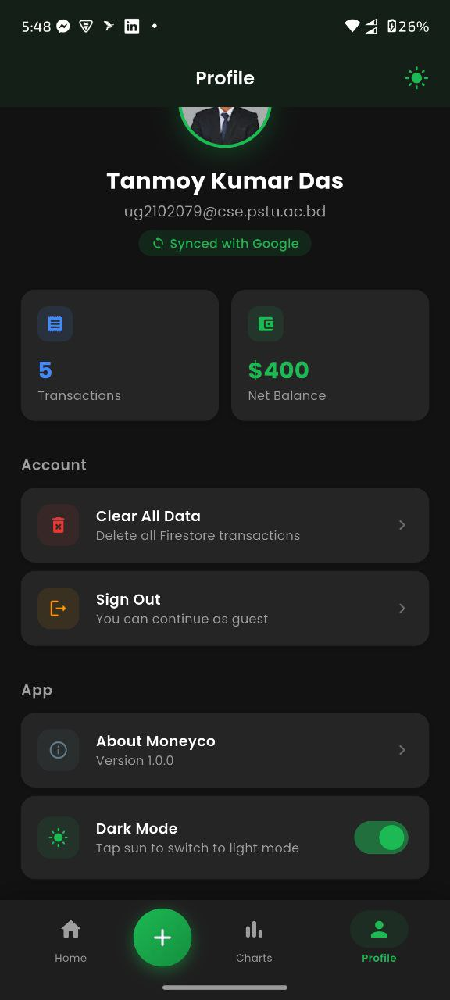
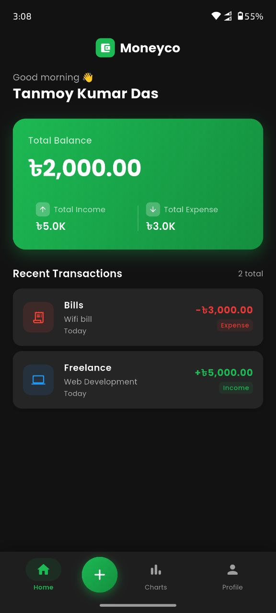
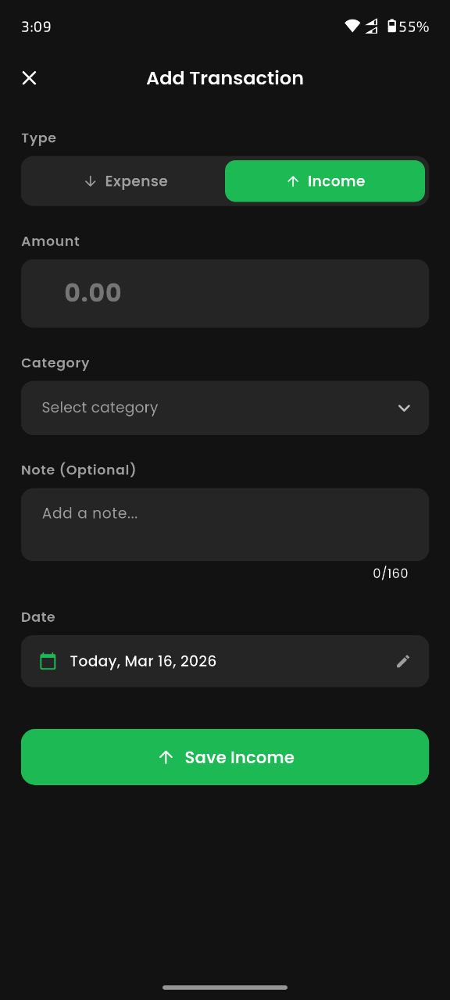

# Project 1: Moneyco

## Screenshots

	
	

	
	

Moneyco is a personal money management app built with Flutter.  
It helps track income and expenses, view analytics, manage budget goals, and keep data synced using Firebase.

## Overview

- App name: **Moneyco**
- Tagline: **Your money, your way**
- Tech stack: **Flutter + Provider + Firebase (Auth, Firestore, Crashlytics)**
- Storage mode:
	- **Guest mode**: local storage (SharedPreferences)
	- **Signed-in mode**: cloud sync with Firestore

## Key Features

- Google Sign-In authentication
- Continue as Guest mode
- Add income/expense transactions with:
	- amount
	- category
	- note
	- date
- Home dashboard with:
	- total balance
	- total income
	- total expense
	- recent transactions
- Analytics screen:
	- monthly bar chart
	- expense category pie chart
	- balance trend chart
- Profile screen:
	- user info
	- transaction stats
	- clear all data
	- sign out
- Budget tools:
	- monthly spending limit
	- daily expense goal
	- in-app alerts when limits are reached/exceeded
- Offline-aware behavior with sync support
- Dark/Light theme toggle

## Project Structure

Main Flutter app location: [Moneyco](Moneyco)

- [Moneyco/lib/main.dart](Moneyco/lib/main.dart) – app bootstrap, Firebase init, providers
- [Moneyco/lib/screens](Moneyco/lib/screens) – UI screens (home, add transaction, charts, profile, login, splash)
- [Moneyco/lib/providers](Moneyco/lib/providers) – app state (auth, transactions, theme, connectivity)
- [Moneyco/lib/services](Moneyco/lib/services) – Firebase, auth, local storage, notifications
- [Moneyco/lib/core](Moneyco/lib/core) – constants, theme, router, helpers

## Dependencies (Major)

- `firebase_core`, `firebase_auth`, `cloud_firestore`, `firebase_crashlytics`
- `google_sign_in`
- `provider`
- `fl_chart`
- `shared_preferences`, `flutter_secure_storage`
- `intl`, `google_fonts`, `uuid`, `connectivity_plus`, `shimmer`

## Run Locally

From the app directory:

1. `cd Moneyco`
2. `flutter pub get`
3. `flutter run`

## Notes

- Firebase configuration files are already present in this project.
- Google Sign-In is supported on Android, iOS, macOS, and Web.
- Linux/Windows builds can continue in guest mode if Google sign-in is unavailable.
